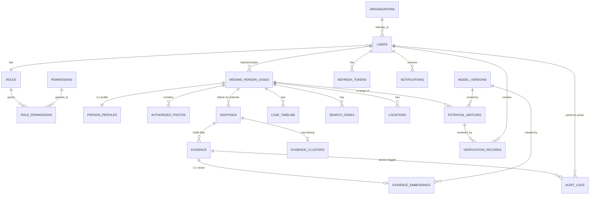

# MISSINGLINK AI — Database Schema

PostgreSQL 16 + **pgvector** + **PostGIS**. Managed via **Flyway** (`V{n}__*.sql`).

## ER diagram (Mermaid)



## Core tables

### users / roles / permissions
- `users(id, email, password_hash, full_name, phone, role_id, organization_id, status, mfa_enabled, otp_secret, created_at, updated_at, deleted_at)`
- `roles(id, name, description)` — `PUBLIC_USER, FAMILY, INVESTIGATOR, ADMIN`
- `permissions(id, name, description)`
- `role_permissions(role_id, permission_id)`
- `refresh_tokens(id, user_id, token_hash, expires_at, revoked, created_at)`
- `organizations(id, name, type, contact_email, status)`

### Cases & profiles
- `missing_person_cases(id, case_reference UNIQUE, reporter_id, status, priority_level, emergency_classification, title, first_name, last_name, age, gender, height_cm, identification_marks, languages, last_known_activity, transportation, possible_destinations, description, is_public, last_known_at, last_known_lat, last_known_lng, last_known_place, resolved_at, created_at, updated_at, deleted_at)`
- `person_profiles(id, case_id UNIQUE, hair, eyes, skin_tone, clothing, accessories, backpack, shoes, other_characteristics, searchable_text, embedding VECTOR(512), embedding_model, created_at)`
- `authorized_photos(id, case_id, uploader_id, storage_key, photo_type, consent_record_id, created_at)`
- `consent_records(id, case_id, granter_id, consent_type, consent_text, signed_at, storage_key)`

### Sightings & evidence
- `sightings(id, sighting_reference UNIQUE, submitter_id, case_id NULL, description, clothing, direction_of_movement, vehicle_info, notes, lat, lng, location_name, captured_at, reported_at, source, status, evidence_cluster_id, created_at)`
- `evidence(id, sighting_id, case_id NULL, uploader_id, storage_key, original_filename, content_type, size_bytes, sha256, malware_scan_status, quality_score, uploaded_at)`
- `evidence_embeddings(id, evidence_id UNIQUE, embedding VECTOR(512), model_version_id, dimension, created_at)` + HNSW index `vector_cosine_ops`
- `evidence_clusters(id, title, centroid GEOMETRY, first_timestamp, last_timestamp, source_count, avg_similarity, meta JSONB, created_at)`

### Matching
- `potential_matches(id, case_id, sighting_id, evidence_id, overall_score, face_similarity, clothing_similarity, accessory_similarity, body_similarity, image_similarity, location_relevance, time_relevance, text_similarity, status, explanation JSONB, limitations JSONB, model_version_id, reviewed_by, reviewed_at, review_notes, created_at)`
- `verification_records(id, potential_match_id, reviewer_id, decision, notes, created_at)`

### Geo & timeline
- `locations(id, case_id NULL, sighting_id NULL, geom GEOMETRY(Point,4326), label, location_type, accuracy_meters, occurred_at)`
- `search_zones(id, case_id, zone_type, priority, radius_km, geom GEOMETRY(Polygon,4326), rationale, ai_generated, reviewed, created_at)`
- `case_timeline(id, case_id, actor_id, event_type, description, payload JSONB, created_at)`

### Notifications / audit / misc
- `notifications(id, user_id, type, title, body, related_case_id, read, created_at)`
- `audit_logs(id, actor_id, action, resource_type, resource_id, ip_address, user_agent, details JSONB, created_at)`
- `reports(id, reporter_id, resource_type, resource_id, reason, status, notes, created_at)` — abuse reports
- `model_versions(id, version, name, face_model, embedding_model, detection_model, metrics JSONB, status, created_at)`

## Indexes (highlights)
- `users.email` unique (lower), `missing_person_cases.case_reference` unique
- GIN on `person_profiles.searchable_text` (pg_trgm) + `tsvector`
- HNSW index on `evidence_embeddings.embedding` (`vector_cosine_ops`)
- GIST on `locations.geom`, `search_zones.geom`
- `audit_logs(actor_id, created_at)`, `potential_matches(case_id, status)`

## Vector similarity (pgvector)
```sql
SELECT e.evidence_id, 1 - (e.embedding <=> :query_embedding) AS cosine_sim
FROM evidence_embeddings e
ORDER BY e.embedding <=> :query_embedding
LIMIT :k;
```
Distance threshold applied in the AI service (e.g. cosine ≥ 0.35) to avoid low-confidence noise.

## Retention & deletion
- Soft delete (`deleted_at`) on cases; hard purge after `DATA_RETENTION_DAYS` via scheduled job.
- Audit logs append-only; access-log of every evidence download.
