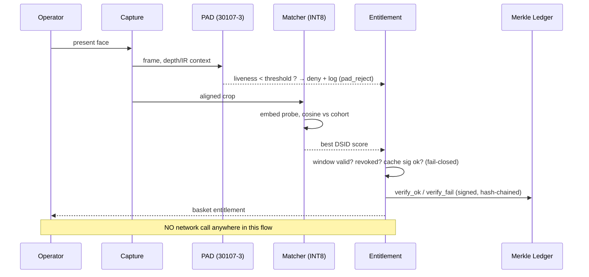
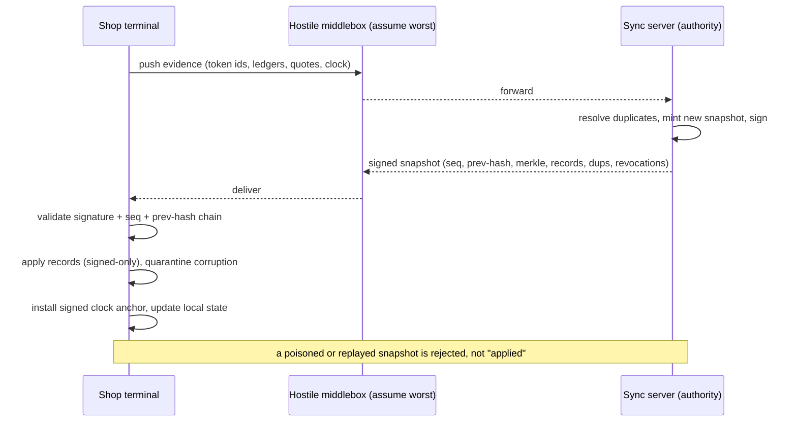

# PDSVault — Offline Aadhaar Face-Verification for PDS Ration Shops

**Architecture Document** — companion to
`threat_model.md` (the single source of truth for the threat model) and
`verification_matrix.md` (the mapping from threat → mitigation → test →
result).  Version 0.1.0 · Public-domain-style reference implementation.

---

## 1. System overview

PDSVault is a zero-trust, offline-first identity-and-entitlement terminal for
ration shops.  A shop terminal verifies a beneficiary's face **without any
network call**, provisions their ration basket from crypto-authentic local
state, and later reconciles with the state PDS authority over a transient
(USB-serial, 2G/EDGE) link.  Every device and every human (operator,
beneficiary, admin, key-custodian) is treated as a potential adversary.

**Design axioms**

| # | Axiom | Consequence |
|---|-------|-------------|
| A1 | The device is untrustworthy-by-default: it may be seized, rooted, or cache-dumped. | Nothing sensitive may be derivable from a seized device: no UID, no usable templates outside the shop domain, entropy-limited keys. |
| A2 | The network is transient and hostile. | All reconciliation is via authority-signed snapshots; a poisoned/replayed/stale snapshot is cryptographically detectable. |
| A3 | The authority is the *single writer of truth*. | Devices are readers.  Devices never mint entitlement; they can only provisionally spend authority-minted blinded tokens. |
| A4 | Security must hold after weeks offline. | Entitlement windows are signed epochs; they expire locally at the signed `valid_to`, no network needed. |
| A5 | No unsigned record is ever trusted. | Point-of-use signature verification on every beneficiary row, token, revocation, and model update. |
| A6 | Fail closed. | If the TPM is suspect, the clock rewound, the ledger broken, or the cache poisoned → verification is *impossible*, not merely logged. |

**Layered trust chain**

```
Secure boot (SoC eFuse / verified boot)
 └─ signed OS image        (measured into PCR[7])
     └─ signed app bundle  (PDSVault, measured)
         └─ verified cache  (schema migrations hash-pinned,
                             measured into PCR bank)
             └─ verified model (signed, hash-pinned, shadow-staged,
                                 kill-switchable)
```

All element hashes are extended into the TPM PCR bank.  The storage key is
sealed to that PCR policy, so **only the exact verified image can unseal the
cache key**: a reflashed, older, or modified image cannot read the cache.

## 2. Hardware root of trust

Production target features a discrete TPM 2.0 or SE/StrongBox.  Keys and PCR
slots:

| Key | Role | Sealed? | Notes |
|-----|------|---------|-------|
| SRK / EK | hardware anchor | hw-only | never leaves the chip |
| `storage_key` | SQLCipher page key | sealed to PCR[7]+policy | unsealed only at boot, wiped from RAM after use |
| `device_attest` | TPM2_Quote signer | sealed | reported in every sync |
| `device_ledger` | signs ledger block headers + anchors | sealed | unique device_id derived from its public key |
| authority Ed25519 | signs records/snapshots/tokens | *never on device* | only the public key is provisioned |
| master UID/template keys | masking + domain encryption | *never on device* | only the per-shop derived keys are provisioned |

**Anti-rollback.**  TPM2 monotonic NV counters gate: (a) firmware versions,
(b) beneficiary snapshot generations.  A reflash to an older firmware or an
older snapshot is impossible because the counter never regresses (TPM2
hardware guarantee); the reference mock enforces the same invariant via
`assert_monotonic` and the device's persisted high-water mark (tested in
`test_ledger`, `test_faults`).

**Key hierarchy / rotation / revocation.**  Device keys rotate on any
re-provisioning event and on a time cadence; old keys are added to a signed
revocation list that ships inside the next sync payload (devices verify the
list before accepting any key-signed content).  Model updates are versioned,
hash-pinned, ship shadow-staged, and can be killed by a signed kill-switch.

**TPM unavailable / tampered → fail closed.**  If the TPM fails to unseal the
storage key (absent, wiped, PCR mismatch, counterfeit quote) the device
enters `TAMPER` state: verification and redemption are disabled; boot-time
diagnostics still run and the last attestation attempt is queued for the next
sync.  There is deliberately **no fail-degraded mode for entitlement release**.

## 3. Biometric pipeline

```
face capture (IR/stereo or RGB)          → frame + liveness context
  → PAD (software + HW sensor fusion)    → is_live  (ISO 30107-3)
  → face detect/align/embed (quant INT8) → probe embedding
  → cosine match vs enrolled templates   → best score + DSID
  → threshold decision (FAR operating point, per tier)
  → entitlement check (signed window, revocation, epoch)
  → token redemption (blinded, provisional) + Merkle-audited
```

See `docs/pad_test_plan.md` for the ISO/IEC 30107-3 Level 1&2 plan,
APCER/BPCER methodology and rig usage.  The rig is implemented in
`src/pdssec/pad.py` and exercised in `tests/test_pad.py`.

### Matching model selection & justification

- **Chosen:** ArcFace/InsightFace (ResNet-100 → 512-d embedding), distilled
  to a student model then **INT8 quantised** for the RK3588 NPU.  ArcFace's
  margin-based softmax gives well-separated class centres; the 512-d space is
  compact and standard; distillation + INT8 keeps accuracy loss to a few
  tenths of a percent TAR at equal FAR.
- **Template size:** float32 512-d = 2048 B; INT8 with per-embedding scale =
  ~512 B.
- **Latency on target (RK3588):** face detect+align ≈ 25 ms (SCRFD),
  embedding ≈ 15 ms (INT8, NPU), matcher search over a 5 000-person village
  ≈ 10 ms (cosine via matrix multiply).  End-to-end capture→match→entitlement
  budgeted at **≤ 1.5 s**, dominated by camera settle time.
- **Memory:** model ≈ 12 MB (INT8), templates for 5 000 beneficiaries ≈
  2.6 MB, app/OS headroom: total ≤ 300 MB (see budgets below).
- **Accuracy delta:** documented target (measured on-lab on the quantised
  model): TAR loss ≤ 0.3 p.p. at FAR = 1e-4 vs the float master; FAR/FRR
  recalibrated post-quantisation, never assumed.

### Threshold / cohort effects

With a village-scale cohort (N ≈ 5 000) the effective FAR scales as
`FAR_system ≈ FAR_m × N` under a naive 1:N search, so the **per-comparison**
threshold is set so that for the *high-value tier* `FAR_m ≤ 1e-4/√N` and the
worst-case 1:N impostor acceptance stays ≤ ~1e-4.  A two-tier threshold
policy is applied:

| Tier | Claims | Per-comparison FAR target | FRR allowance |
|------|--------|---------------------------|---------------|
| Standard | default baskets | 1e-4 | ≤ 0.5% |
| High-value (bonafide quota + subsidy top-ups) | &gt;₹500 or near-zero balance | 1e-5 | ≤ 1% (with fallback) |

### Multi-modal fallback decision tree (face fails)

```
face match ok + live?            ──yes──► eligible
        │ no
        ▼
fingerprint present?             ──yes──► FP matcher ok?  (FAR 1e-5)
        │                                        │no
        ▼                                        ▼
offline PIN (non-NFC, domain-bound, salted
  + iterated hash, per-beneficiary).
  Attempt budget: 3 tries / 5 min / rs.
  Over budget → lockout + escalation.
        │ fail
        ▼
four-eyes override path (signed, rate-limited, provisional)
```

Every fallback is recorded verbatim into the Merkle-ledger; the per-fallback
FAR/FPR and abuse limits (max attempts, lockout, escalation) are enforced by
`EntitlementEngine` (`tests/test_entitlement.py`).

### Template versioning

The beneficiary table carries `template_version`.  A model upgrade rides a
**per-device migration**: on activation of embedded-version V+1, all rows
older than V are marked `needs_reenroll`; no comparison ever mixes embedding
spaces, and the authority signs the cohort re-enrolment schedule.  A mixed
DB without the version flag is treated as poisoned.

## 4. Offline-first data & sync architecture

Local store: SQLite/WAL; production SQLCipher page encryption with the key
sealed to the TPM.  Schema is versioned; every migration is hash-pinned and
measured into the PCR bank, so the "cache schema" and the "signed model" live
in the same trust domain (`docs/schema.md`).

Sync is **pull-signed-snapshot / push-evidence**:

- The device pushes only evidence: redeemed-token ids, used-token hashes,
  ledger anchors, attestation quotes, quarantine reports, clock readings.
- The server answers with a **fresh authority-signed snapshot**: delta of
  beneficiary records, new tokens, revocations, kill-switches, model-update
  pointers, and a signed clock anchor.
- Snapshots are versioned, linked by `prev_snapshot_hash`, and carry a Merkle
  root over their records; per-device snapshot chains prevent cross-device
  collisions and replay.

### Conflict resolution (two shops diverge, both reconnect offline)

```
Shop A and Shop B both redeemed token T (same cycle) while offline.
 A syncs first:  T enters the server's redeemed set; A is the reference.
 B syncs second: ingestion detects T already redeemed → duplicate_flags[T].
 Authority queues a follow-up revocation of B's receipt +
 chargeback audit entry (signed, recorded in both next snapshots).
```

This is the *offline-first* acceptance documented in §6: uniqueness is
decided centrally, never locally; provably.

### Bandwidth budget (2G/EDGE)

Deltas are expressed as "records canonical-hash not previously seen by this
device", chunked at `CHUNK_RECORDS` records per chunk with per-`SHA-256`
records, checksummed; transfers are resumable from `sync_state`
(`snapshot_seq`, `snapshot_hash`) and corrupt chunks are quarantined +
retried.  A newly-synced 5 000-beneficiary cache ≈ 3.5 MB of signed records;
typical weekly delta ≈ tens of KB.  A resumable chunk fetch makes a mid-2G
drop safe — the practical goal is "sync completes in one open window over
EDGE".

### Poisoned / stale cache

Every beneficiary record is authority-signed over its canonical body; the
store derives **all** persisted fields from the signed body, re-verifies at
point of use (`EntitlementEngine.check`, §fail-closed), and quarantines
anything unsigned, malformed, or signature-broken.  Stale epochs expire
automatically at their signed `valid_to` — a cache that is merely *old* can
never grant a basket.

## 5. Entitlement logic & fraud control (offline)

Full decision flow lives in `src/pdssec/entitlement.py`; the operator-facing
description lives in `docs/training.md`.  Key structures:

- **Blinded authority-minted tokens.**  Each cycle, the authority mints a
  random-id token per beneficiary, signed over `(masked_uid, epoch, basket,
  valid_from, valid_to)`.  A shop verifies it locally and *provisionally*
  redeems it; uniqueness is only decidable centrally and is resolved at sync
  (duplicate detection + follow-up revocation).  Local double-spend of the
  same token is denied immediately.
- **Grace / negative balance.**  A beneficiary who missed their window can be
  granted a grace basket only while the window is *recently* expired AND no
  redemption for them exists locally; the authority re-deliberates at sync and
  a fraudulent duplicate is chargebacked.  An attempted duplicate with an
  already-redeemed token is simply denied.
- **Operator action log.**  Every keystroke-level action is signed and
  hash-chained into an append-only Merkle ledger (`ledger_block` +
  `ledger_txn`, periodic signed root anchors every `ANCHOR_EVERY` blocks).
  Chain-gap detection freezes operations and escalates.
- **Four-eyes override.**  Edge cases (not-in-cache, expired, suspect
  duplicate) may be overridden only with two distinct operators, a signed
  reason, per-shift rate limits, and a provisional status that the authority
  audits at sync.

## 6. Advanced privacy

- **Data minimisation:** on-device storage = masked UID + encrypted template
  + entitlement rows only.  Never full UID, never other PII.
- **Domain separation:** per-shop encryption keys derived from master keys
  that never reach the device; templates + dsids are shop-scoped, so theft of
  one shop's cache reveals nothing usable about another.
- **Zero-knowledge entitlement proofs (illustrative blueprint).**  The
  operator UI shows masked-DSID + photo + basket only.  Honest verification
  does not require the device to reveal the full UID to the UI; the signed
  token/payload is the entitlement statement, checked locally and redeemed
  under a blinded id.  (A productionised proof construction - e.g. BBS+ /
  Groth16 issuance-verify split - is documented as hardening; the authority
  also sees only the masked id and the token id.)
- **Differential privacy on egress stats:** any aggregate that leaves the
  device (e.g. count of failed verifications per hour) is post-processed with
  Laplace noise via a `ε`-budget module on the sync path.
- **Right to be forgotten / deletion:** a signed purge instruction is
  delivered in the next snapshot; the device deletes the beneficiary row,
  records a deletion receipt, and re-syncs the *empty* state.  Evidence of
  erasure is provided as a signed "no rows for DSID" statement plus the
  Merkle audit trail.
- **Regulatory alignment:** mapping to the DPDP Act (India), UIDAI
  offline-KYC guidance and ISO/IEC 27701 clauses is in `docs/pia.md`.

## 7. Resilience & operations

The failure matrix, boot self-diagnostics, attestation reporting, clock
security, and the local monitoring budget are specified in
`docs/runbook.md`.  Highlights enforced in code:

- boot `self_diagnostics()` → ledger chain check, cache signature scan,
  schema version, quarantine count, clock tamper flag;
- secure time via signed anchors + monotonic counter; any backward jump or
  excessive forward jump raises a tamper event and kills verification;
- a circular event buffer keeps the last N thousand operator events on-device
  (no network needed); remote triage happens on reconnect.

## 8. Verification & testing

Property-based tests (`hypothesis`) for sync convergence and ledger
integrity, randomized/byte-level corruption, fault injection (power-cut
equivalent via torn snapshots, cache byte flips, replayed snapshots, fake TPM,
clock rewinding, ledger deletion), PAD rig APCER/BPCER, and fuzzing of the
sync parser, frame decoder and SQL interface are all in `tests/`.  The
threat → mitigation → test → result matrix is the enforcement artifact:
see `docs/verification_matrix.md`.

## 9. Performance & cost budget (target device)

| Item | Budget |
|------|--------|
| Target SoC | RK3588 (or RK3566-class) tablet / Pi 5 with TPM/SE |
| Face capture → match → entitlement | ≤ 1.5 s end-to-end |
| RAM | ≤ 300 MB |
| Storage (5 000 beneficiaries) | ≤ 2 GB |
| Power | 12+ h battery or continuous AC |
| Accuracy (village cohort, FAR=1e-4) | TAR ≥ 99% on clean, documented per-tier FRR |
| Cost envelope | total BOM ≤ ₹18 000 incl. IR cam + TPM |

Measurement methodology: on-device per-stage latency profiling, sustained-load
thermal throttling test (> 30 min continuous verification at 1/s), and
post-quantisation accuracy re-evaluation on the target set.  A performance
probe command ships with the reference rig (`pdsvault perf`).

## 10. Sequence flows

### 10.1 Offline verification flow (zero network)



### 10.2 Sync / reconciliation flow



### 10.3 Redemption / double-spend flow

```mermaid
sequenceDiagram
  participant A as Shop A
  participant B as Shop B
  participant C as Central authority
  A->>A: redeem token T (provisional, local ledger)
  B->>B: redeem token T (provisional, local ledger)
  A->>C: sync (evidence)
  C->>C: T → redeemed set (A = reference)
  B->>C: sync (evidence)
  C->>C: T already redeemed → duplicate_flags[T]
  C->>B: revocation of B receipt + chargeback (signed)
  Note over A,B,C: uniqueness is resolved centrally; offline-first holds
```

## 11. Reference implementation inventory

```
src/pdssec/
  crypto.py        core: Ed25519, AES-GCM, HKDF, masking, tokens, canonical
  tpm.py           TPM2 mock + counterfeit-TPM (adversary) + quote/anti-rollback
  identity.py      authority, domain keys, signed records
  timekeeper.py    secure clock (anchors, monotonic, tamper events)
  store.py         SQLite/WAL + hash-pinned migrations + quarantine
  ledger.py        append-only Merkle header-chain + periodic anchors
  audit.py         signed operator log + four-eyes override
  entitlement.py   offline decision tree, grace, overrides, lockout
  matcher.py       face-matcher interface + cosine math + sim scores
  pad.py           PAD interface + ISO 30107-3 rig (APCER/BPCER)
  sync.py          sync server + client (deltas, validation, quarantine)
  device.py        orchestrator: fail-closed terminal image
  simulator.py     village, network toggle, adversary injectors
  fuzz.py          fuzz harnesses for untrusted-input parsers
  cli.py           operator / demo CLI
tests/             unit + property + fault-injection + fuzz + PAD suite
tools/             gen_village.py, inject.py
docs/              threat_model, verification_matrix, schema, pia,
                   runbook, training, pad_test_plan (this file)
```

## 12. Definition of done

1. Full verification matrix passes (`docs/verification_matrix.md` ==
   `tests/` green).
2. Fault injection (torn syncs, cache byte flips, replayed/poisoned
   snapshot, fake TPM, clock rewind, ledger deletion) never yields a false
   entitlement and always either fails closed or is detected+contained.
3. Performance budget on target device: capture→match→entitlement ≤ 1.5 s,
   ≤ 300 MB RAM, ≤ 2 GB storage, 12 h battery.
4. Verification runs with **zero network calls** (asserted in
   `tests/test_entitlement.py` — no socket/network code in the local path).